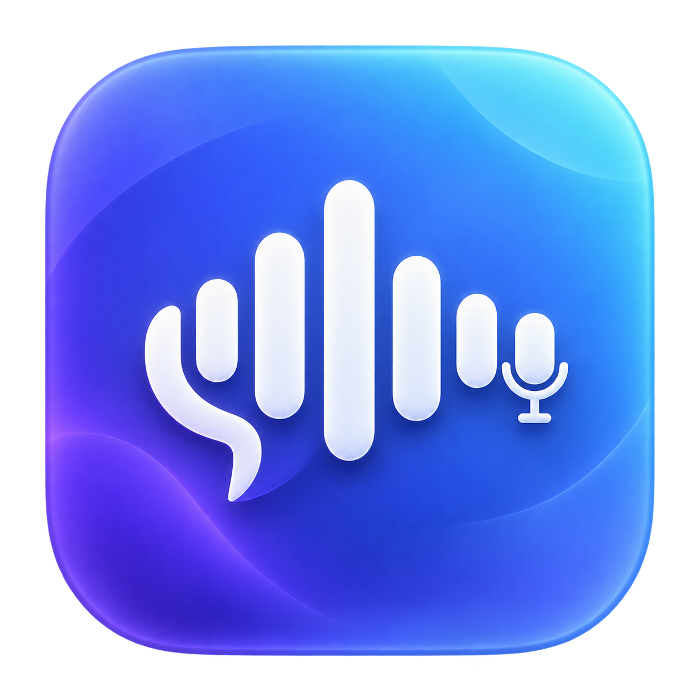

<p align="center">
  
</p>

# Whisper Mac

Локальное приложение для расшифровки аудио и видео на Mac с Apple Silicon. Распознавание выполняет MLX Whisper, разделение участников — pyannote Community-1. Исходные записи не отправляются в облачный сервис распознавания.

## Возможности

- нативный интерфейс SwiftUI и drag-and-drop;
- пакетная обработка нескольких записей;
- ускорение Apple Metal;
- выбор качества, языка и количества участников;
- локальные голосовые профили знакомых участников;
- экспорт TXT, Markdown, JSON, SRT и VTT;
- загрузка runtime и моделей по требованию;
- хранение Hugging Face token в macOS Keychain.

## Требования

- Mac с Apple Silicon;
- macOS 13 или новее;
- интернет при первой подготовке runtime и моделей;
- Hugging Face read-token для диаризации.

## Быстрый старт

```bash
git clone https://github.com/Subnakich/whisper-mac.git
cd whisper-mac
./scripts/build_pkg.sh
open build/WhisperMac-0.3.1.pkg
```

После установки:

1. Откройте **Whisper Mac** и нажмите **Подготовить приложение**.
2. Для разделения голосов примите условия [pyannote Community-1](https://huggingface.co/pyannote/speaker-diarization-community-1) и сохраните read-token в приложении.
3. Перетащите записи в окно, выберите папку результатов и нажмите **Создать расшифровку**.

Модели и runtime загружаются не в `.app`, а в `~/Library/Application Support/WhisperMac`. Повторная установка приложения их не удаляет.

## Структура

```text
app/       SwiftUI-приложение, Info.plist и иконка
cli/       Python-пайплайн распознавания и диаризации
docs/      инструкции пользователя, CLI и подписи релизов
scripts/   сборка .pkg и установка CLI для разработки
```

## Разработка

Тесты Python-ядра:

```bash
PYTHONPATH=cli/src python3 -m pytest cli/tests -q
```

Автономный CLI:

```bash
./scripts/install_cli.sh
source cli/.venv/bin/activate
whisper-mac --help
```

## Документация

- [Установка и использование](docs/USAGE_RU.md)
- [Разработка CLI](docs/CLI_DEVELOPMENT.md)
- [Параметры CLI](docs/CLI_RU.md)
- [Подпись и нотариализация](docs/SIGNING_RU.md)
- [Публикация на GitHub](docs/GITHUB_RU.md)
- [Устройство приложения](docs/APP_STRUCTURE.md)

Локальная сборка получает ad-hoc подпись. Для распространения без предупреждений Gatekeeper нужны Developer ID Application, Developer ID Installer и нотариализация Apple.
